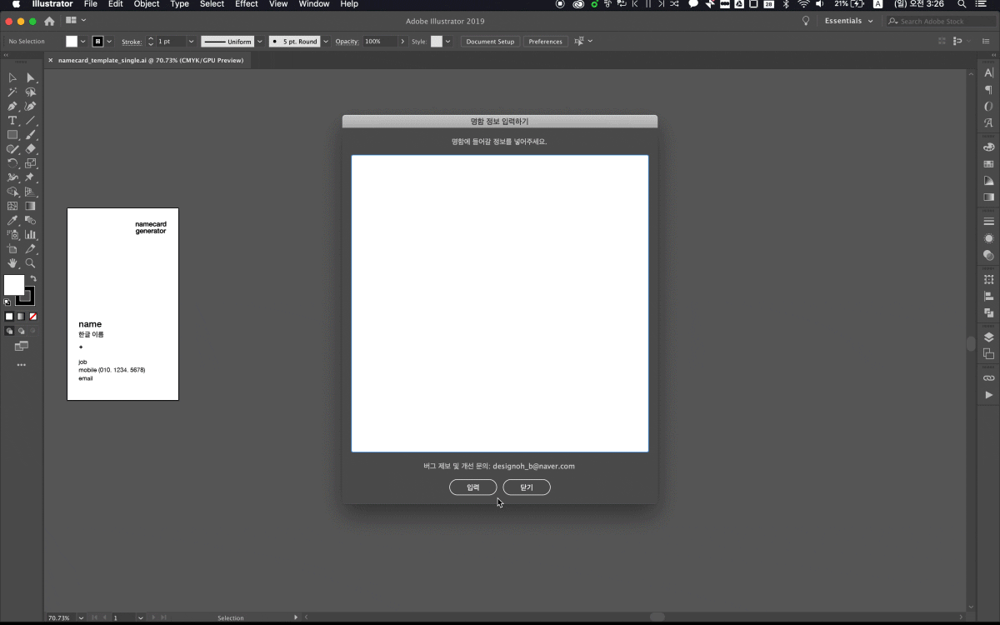

# namecard_generator

Adobe Illustrator Script for generating business card automatically  
**namecard_generator**는 어도비 일러스트레이터에서 사용할 수 있는 명함 생성 자동화 스크립트입니다.  

 

# namecard_generator 사용 방법

### 1) 템플릿화한 명함 파일을 연다.
   스크립트 사용 전 간단한 사전 작업이 필요합니다. 아래 **스크립트 사용 전 필수 작업**을 참고해주세요.
### 2) **namecard_generator** 스크립트를 실행한다.
   하단의 설치 방법을 참고하여 사용 전 미리 스크립트를 설치해주세요. 
### 3) 구글 스프레드시트에서 필요한 정보를 복사하여(변수 포함) 스크립트 창에 붙여넣는다.
   데이터를 복사할 때 **반드시 변수 이름을 포함**하여 복사해야 합니다. 

 

스크립트가 정상적으로 실행되면 '정보가 성공적으로 입력되었습니다.'라는 얼럿이 뜨며, 'OK'를 누르면 정보 입력이 마무리됩니다. 

입력되는 텍스트 길이에 따라 디자인이 터질 수 있으니, 스크립트 실행 이후에는 각 아트보드를 확인하는 것을 권장합니다. 
이후 폰트 깨기/내보내기 등 주문을 위해 필요한 후작업을 하시면 됩니다. 

 

# 스크립트 사용 전 필수 작업 (템플릿화 사전 작업)

명함 제작 자동화 스크립트를 원활하게 사용하기 위해서는 기존에 디자인되어 있던 명함 파일을 템플릿화하는 사전 작업이 필요합니다.

이 작업은 **최초 1회**만 필요하며, 약 1~2분 정도 소요됩니다.
 

### 1) 오브젝트 및 레이어 분리

명함에 들어가는 정보들 중 스크립트로 바꾸고 싶은 정보들만, 아래 이름에 맞게 레이어를 생성하여 각각 옮겨줍니다. (대소문자 구분)  

**정보 오브젝트** | **레이어 이름**
:---------: | :---------:
한글 이름 | nameKor
영어 이름 | nameEng
직무 | job
직급 | position
소속 | team
핸드폰 | mobile
전화번호 | phone
이메일 | email
팩스 | fax

로고, 시각 요소 등 바뀌지 않는 오브젝트들은 한 레이어에 따로 모으고, 다른 레이어와 헷갈리지 않게 'template', 'default' 등으로 적당히 레이어 이름을 바꿔두면 좋습니다.

### 2) 레이어 패널의 옵션에서 'Paste Remembers Layers' 체크
'Paste Remembers Layers' 항목이 설정되어 있어야 스크립트가 정상적으로 실행됩니다.

### 3) 다른 이름으로 저장하여 템플릿 파일 따로 보관

 

# 스크립트 설치 방법

어도비 일러스트레이터 스크립트 폴더 경로에 namecard_generator_v1.0.jsx 와 json2.js 두 파일을 다운 받는다.

**- Windows**

  `Program Files > Adobe > Adobe > Illustrator > 사전 설정 > en_US > Scripts`

**- Mac**

  `응용 프로그램 > Adobe Illustrator > Presets > en_US > Scripts`

참고) 일러스트레이터가 어떤 언어 버전으로 설치되어 있느냐에 따라 중간 폴더 이름이 `en_US`가 아닌 `en_GB`, `ko_KR` 등일 수 있습니다.

 

---
### 버그 제보 및 개선 문의
designoh_b@naver.com

douglascrockford 님의 json2.js 을 사용했습니다. (json2.js is owned by douglascrockford.)
https://github.com/douglascrockford/JSON-js
